	#Como realizar un sencillo mapa de cloropletas en QGIS

En este tutorial aprenderemos a realizar un sencillo mapa de cloropletas con QGIS. Todos los pasos necesarios están descritos aquí abajo. Crearemos un mapa de densidad de población por municipios (renta).   
Necesitaremos descargar dos conjuntos de datos, los `shapefiles` y el `csv`. Después cruzaremos los datos mediante el id único de cada municipio. Empecemos:   

1. Descargamos los shapefiles oficiales del enlace del CNIG:   
	**Centro de descargas del Instituto Geográfico Nacional** [Link ](http://centrodedescargas.cnig.es/CentroDescargas/equipamiento/lineas_limite.zip)   
	En este enlace descargaremos los archivos oficiales en formato _shapefie_ (.shp). Este archivo incluye más shapefiles de los que vamos a necesitar. Si hubiera algún problema con la descarga también se encuentra en la carpeta `shapefiles`del repositorio.    

2. Descomprimimos los archivos. Vamos a trabajar con dos archivos incluidos en dos carpetas diferentes:

	- `recintos_municipales_inspire_canarias_wgs84`   
	- `recintos_municipales_inspire_peninbal_etrs89`   

	El resto de carpetas contienen las entidades Comunidades Autónomas y Provincias (recintos) además de los contornos (líneas).

3. Abrimos los dos archivos en QGIS. Es importante seleccionar la **codificación** `UTF-8` para no perder información. Si observamos, el mapa ha adoptado una apariencia _achatada_ debido a una proyección incorrecta. Es importante que especifiquemos una proyección adecuada en la pestaña inferior derecha.

	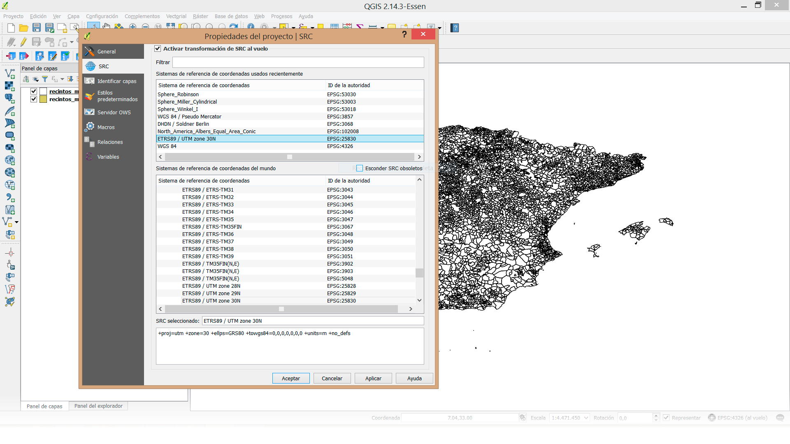   

	Esta opción se conoce como `on the fly` o `al vuelo` ya que realiza un calculo en tiempo real pero no establece una proyección específica a nuestro proyecto. Nos vale.   
	Seleccionamos la proyección `ETRS89 / UTM zone 30N` ó  `EPSG:25830`).   
	Tenemos todo el mapa de España por municipios dividido en dos capas, dos archivos diferentes.   
	La siguiente operación será unir o `mergear` los dos `shapefiles` para conseguir un único archivo que contenga los polígonos de todos los municipios de España.

4. Antes de hacer el `merge` con la península debemos asegurarnos de que los dos archivos se encuentran representados bajo el mismo sistema de coordenadas. Como observamos en el nombre de la carpeta y del archivo, el `shapefile` de las Islas Canarias está utilizando el sistema de coordenadas `WGS84`.   
   
Para ello debemos convertir este shapefile generando una copia bajo el sistema `ETRS89`. Pulsamos el botón derecho sobre la capa de Canarias y seleccionamos `guardar como`. En la pestaña de `SRC` . Seleccionamos `ETRS89`.    

	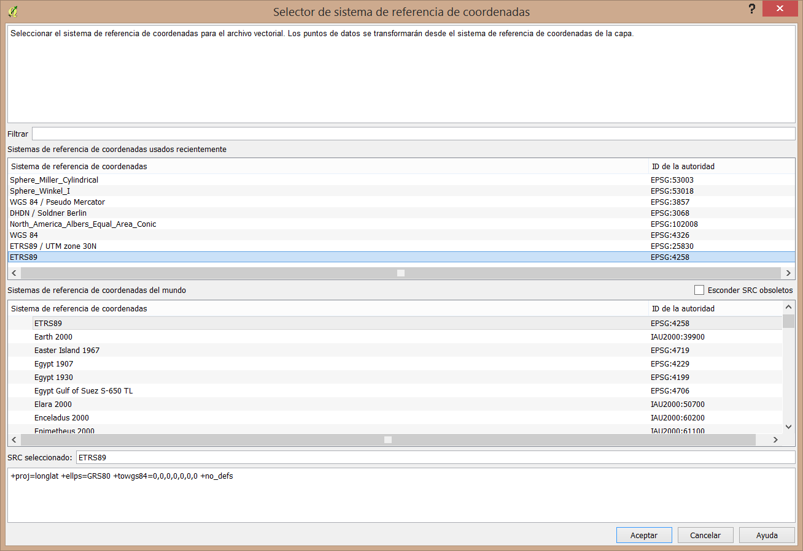   

 Seleccionamos la opción `Añadir archivo guardado al mapa`. Guardamos.   
 Se nos habrá añadido al mapa un nuevo `shapefile` de Canarias en `UTM`. Podemos eliminar la capa original de Canarias.    
 A continuación uniremos las dos capas en un sólo archivo. Para realizar este paso es fundamental que las dos capas compartan el mismo sistema de coordenadas.   

5. Seleccionamos la pestaña `procesos` del menú superior. Seguidamente `Caja de Herramientas`. Y a continuación la herramienta `merge_vector_layers` (podemos hacer una búsqueda con `merge` como en la imagen abajo).
	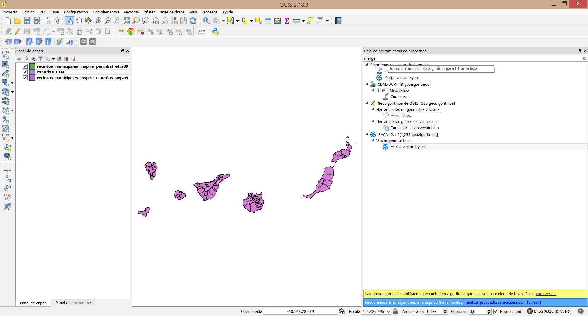   

	Seleccionamos las dos capas, nombramos nuestro nuevo archivo. Podemos comprobar como las dos se encuentran en `EPSG:4528`.   

	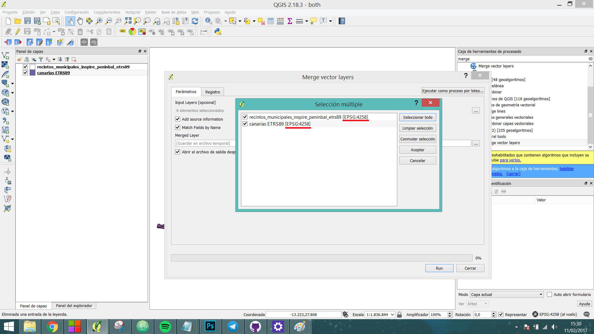   

	Abrimos nuestro nuevo archivo. Siempre seleccionando la codificación correcta `UTF-8`.
6. **Tabla de atributos**: Podemos acceder con el botón derecho sobre la capa o en el icono 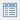. Se nos abrirá la siguiente ventana:
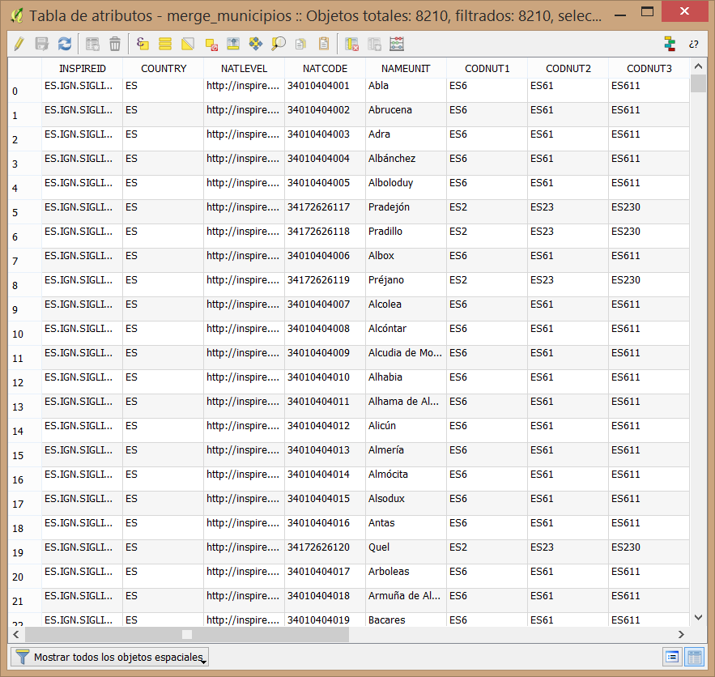      

	Gracias a haber seleccionado una correcta codificación vemos como los nombres de los municipios presentan todos sus caracteres de manera adecuada. Una tabla completa de atributos sobre la que podremos realizar casi cualquier tipo de cálculo para filtrar en base a unas reglas, modificarlos o incluso crear nuevos campos.  
	En este caso nos interesa el campo `NATCODE`. Esta celda contiene un código único que identifica de manera inequívova a cualquier polígono (municipio). Con una sencilla operación, podemos extraer el código del **INE** de este campo para poder cruzarlo con el `CSV` a continuación. No olvidemos que nuestro objetivo es poder asociar unos valores específicos a cada municipio y para ello necesitamos un `id`.   
	Para éste propósito contamos con la `calculadora de campos` 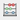. Hacemos click sobre el icono.   
7. **Calculadora de campos**. En primer lugar introducimos el nombre del campo de salida (será la cabecera de la nueva columna), por ejemplo `cod_ine`. En segundo lugar y **muy importante** seleccionar el tipo de campo de salida como `Texto` (cadena) ya que queremos preservar los ceros al comienzo de nuestro código cuando éste sea inferior a 5, por ejemplo `04004` y no ~~`4004`~~. A continuación vamos a utilizar un método del desplegable `Cadena` (String) llamado `substring`. Este método nos permitirá modificar el valor de una celda en base a tres argumentos:     

	* `cadena_de_entrada` => nombre de la columna de la cual queremos obtener nuestro nuevo campo.   
	* `startpos` => posición inicial desde la que comenzaremos a extraer caracteres (empezando por el primero).
	* `longitud` => longitud de la cadena a extraer.   

	En este caso nuestra fórmula será como muestra la imagen:

	

	En la parte inferior izquierda de la calculadora podemo observar una vista preliminar de la salida.   
	Si en algún momento de este proceso nos equivocamos deberemos eliminar el campo y crear uno nuevo o actualizarlo en la opción superior derecha `actualizar campo existente`(tan sólo podremos actualizar el contenido, no la naturaleza del campo). Al finalizar deberemos salvar desde la tabla de atributos 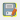.   

8. **Añadir un CSV**. A continuación vamos a cargar los datos que queremos asociar a cada municipio. Podríamos añadir esta nueva capa de la misma manera que añadimos los archivos vectoriales pero existe una opción específica para los archivos de texto. Seleccionamos `Capa` o el icono de acceso directo . Seleccionamos el archivo desde el explorador, codificación correcta, el delimitador correcto (`;`, `,`, `tabulador`...) y por último la opción `ninguna geometría` ya que tan sólo queremos cargar el csv como una tabla de atributos.    

	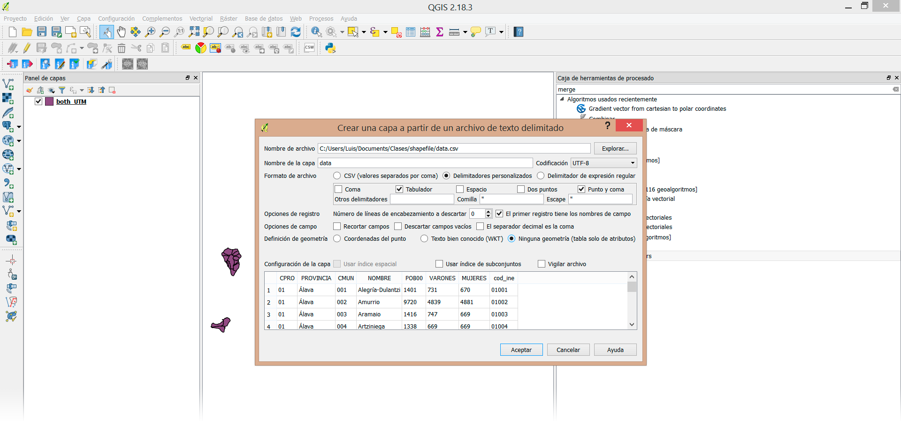   

	Si nuestro objetivo fuera representar una serie de puntos sobre el mapa y nuestro csv tuviera columnas con los campos `longitud` y `latitud` deberíamos especificarlas en los correspondientes desplegables.   
	Vemos nuestra nueva capa con un icono diferente ya que no es una capa de tipo vectorial. A continuación nuestro objetivo será cruzar los datos mediante los `ids`.

9. **Uniones**. Hacemos click con el botón derecha sobre nuestro shapefile => propiedades => `Uniones` y en el icono . Seleccionamos la capa con la cual queremos hacer el `join` y los dos campos que cruzaremos. Podemos elegir qué campos queremos unir, en este caso sólo nos interesa el de población.
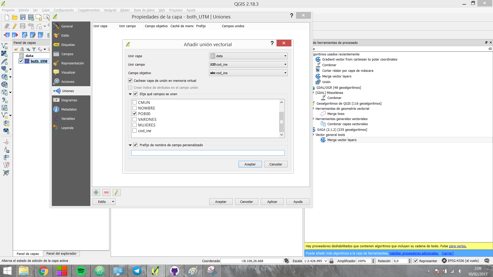

10. **Cálculo de densidad**. Volvemos a abrir la calculadora de campos. Y seguimos los pasos aprendidos para generar un nuevo campo. Esta vez la densidad de población.
Importante seleccionar como tipo de salida de campo `Número decimal (real)`, `longitud de campo de salida`: `20` y una precision mínimo de `10`. E introducimos la siguiente expresión:

		`to_real( "data_POB00"  /  $area  ) `   
Esta opeación nos generará un nuevo campo con la densidad de población por municipio. A continuación
sólo deberemos aplicar una escala de color a nuestros datos.   

11. **Print Composer** Una vez tenemos nuestro mapa queremos crear una imagen a buena resolución de nuestro mapa, listo para publicar. Pulsamos en el icono 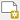.
Podemos rellenar el campo nombre. A continuación en añadir mapa 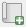.    
Con el ratón pulsado arrastramos desde una esquina hacia la contraria dibujando la extensión del `canvas`. Apareceá exactamente lo mismo que estabamos viendo en la ventana principal de `QGIS`. Existe la posibilidad de eliminar el fondo y exportar la imagen con transparencia (muy útil si luego vamos a trabajar con ella en algún otro programa). En la pestaña `Diseño`del menú derecho	y en el apartado `Configuración de página` seleccionamos `Cambiar`: **borde** y **relleno** transparente.   
En la pesataña 	`Propiedades del elemento` deseleccionamos la pestaña `fondo`.   

	Si queremos crear una composición que incluya las Islas Canarias cerca de la península tendríamos que crear dos mapas en nuestro `print composer`:
	- Sin cerrar esta ventana volvemos a la vista principal de QGIS. Hacemos zoom sobre la península.
	- Volvemos al diseño de impresión y añadimos un nuevo mapa. En esta ocasión debería aparecer sólo la península.
	- De nuevo en la ventana principal hacemos zoom sobre las Canarias. En el diseño de impresión añadimos un nuevo mapa. Aparecerán las Islas Canarias. Podemos ayudarnos de la herrmienta `Mover contenido del elemento` 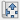 para manejar mejor las dos capas y de las opciones bloquear del menú superior derecho `Elementos`.   
	- En el apartado `Propiedades principales` podemos servirnos del apartado `Escala` para asegurarnos de que los dos mapas conservan la misma proporción.
	- Si queremos podemos añadir un rectángulo alrededor del archipiélago para remarcar la composición en `Añadir figura geométrica`.
